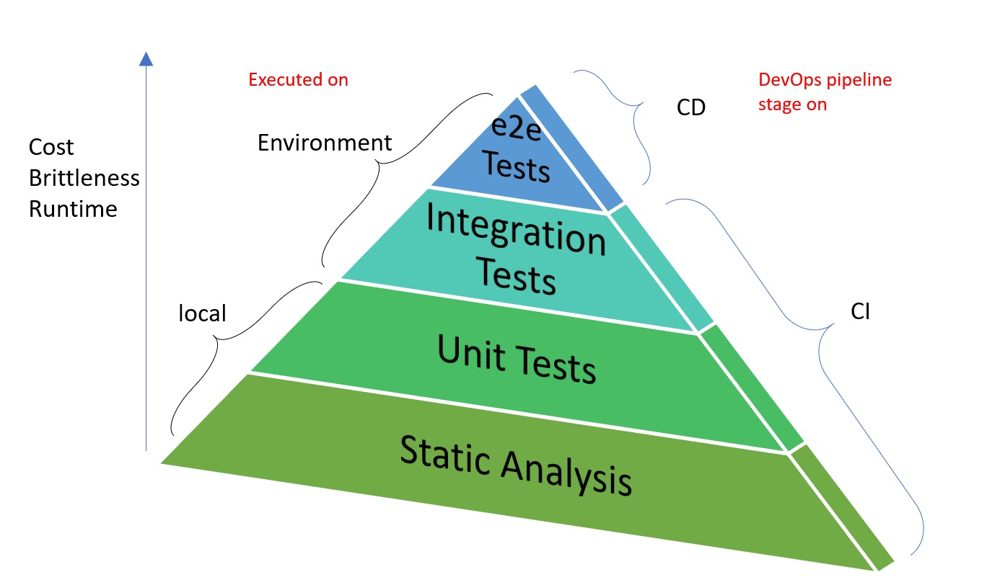

# Continuous Testing for Infrastructure as code based on Terraform & Terratest
infrastructure-as-code-testing provide a Go packages to apply continuous testing of a simplify way on the cloud infrastructure.
In the real world exists several IAC tools but these are not provide a framework native to test code written in the descriptor language based in a devops pipeline.
These Go packages seek to simplify testing and meet the testing demands of a devops cycle.

[`terraform`](https://www.terraform.io/) and [`terratest`](https://terratest.gruntwork.io/) are the best tools I have found to develop these packages in the most robust way, so you can found many references based on these tools.

Click on the names of the tools to enter their official links.

## Concept
If we can treat to the infrastructure like code snipe so we can make continuous testing on that and add it to our **CI/CD pipelines**.
When we works over dynamic environments as **cloud platforms** is easer test if infrastructure code works and it will not break our environment when its deployed.
An infrastructure deployment can be apply changes to create, modify or destroy some part of or completly an environment. These changes are reflects in provisioning and configuration management processes normally.

For write fully test for infrastructure code we can consider the following outline:

### 1. Static Analysis: Test code without deploy it.

* Parser/interpreter: Check code for syntactic and structural issues. e.g: `$ terraform validate`
* Linter: Statically validate to catch common errors.
* Dry run: Excute the code partially and validate the plan but don't actually deploy. e.g: `$ terraform  plan`

### 2. Unit Tests: Test a single module isolated.

Can't test an entire architecture using unit tests. Better split the architecture in small modules and test each one unitly of them.

One `.tfstate` file should be generated for each one module unit test.

> It can be said that a good unit test in infrastructure code is deploying to a real environment so it should be include:
>
> * Deploy real infrastructure. e.g: `$ terraform apply`
> * Validate it works. E.g. via HTTP request, API calls, SSH commands, etc.
> * Undeploy the infrastructure. e.g: `$ terraform destroy`
>

### 3. Integration Tests: Test multiple modules working together and related.

A module can be dependent on another or be the dependency. Therefore, integration test consists of running the test with all related modules and passing the inputs and outputs between them as appropriate to be sure that an update does not break any predefined integration and is backward compatible.
    
   > `terratest` propose use **Test parallelism** for modules no related and **Test stages** for modules related to pass data between stages.
   >

### 4. End-to-end tests: Test how works an entire architecture in a deployment environment.

Here we can use the same strategy that unit test but apply it in a landing zone connected with environment dependencies: 

* Deploy all the environment infrastructure
* Validate if it works via HTTP requests or API calls to main resources.
* Undeploy all the environment infrastructure

> It can take a long time so it could be not executed frequently in a CI phase. It should be execute in a pre-delivery or as part of CD phase.

---
## Usage model


> Original documentation and concepts were inspired in the best practices by Gruntwork-io. see [here](https://terratest.gruntwork.io/docs/testing-best-practices/unit-integration-end-to-end-test/)

## Install

* Terraform Bash v0.13.+ (https://www.terraform.io/downloads.html)
* Go binary go1.15+, follow [the official instructions](https://golang.org/dl/).

## Use

Authentication method is the same used to run terraform command directly. For Azure you can see [official documentation](https://www.terraform.io/docs/providers/azurerm/guides/service_principal_client_secret.html). 

This sample use Azure CLI authentication assuming that you run it locally.

### Static Analysis
It is a function embedded inside unit testing package to simplicity implementation. However, it can be called independent as well.

1. Import unit_testing package from [`unit-testing`](https://github.com/czelabueno/infrastructure-as-code-testing/unit-testing) directory.
2. Initialize TerraModule struct to handle any terraform module. e.g. `mymodule := unit_testing.TerraModule{...}`.
3. Run to RunStaticAnalysis function. e.g. `mymodule.RunStaticAnalysis(...)`.
4. Assert the expected result versus returned result.

```go
TODO- some code
```
### Unit Testing
You can to see more scenarios implemented [samples/azure_storage_unit_test.go](https://github.com/czelabueno/infrastructure-as-code-testing/blob/master/samples/azure_storage_unit_test.go)

> Validate function is a generic implementation to confirm if resource works in the Cloud provider, so it call to [Azure Resource Health Rest API](https://docs.microsoft.com/en-us/rest/api/resourcehealth/availabilitystatuses/getbyresource) to confirm that resource is available and operating.
>
> The implementation for [AWS Service Health Check](https://docs.aws.amazon.com/health/latest/APIReference/Welcome.html) is pending yet.


1. Import unit_testing package from [`unit-testing`](https://github.com/czelabueno/infrastructure-as-code-testing/unit-testing) directory.
2. Initialize TerraModule struct to handle any terraform module. e.g. `mymodule := unit_testing.TerraModule{...}`.
3. Run unit test calling to TerratestExecution function. e.g. `mymodule.TerratestExecution(...)`.
4. Assert the expected result versus returned result.

```go
package main

import (
	"testing"
	unit_testing "github.com/czelabueno/infrastructure-as-code-testing/unit-testing"
	"github.com/stretchr/testify/assert"
)

func Test_MyModule(t *testing.T) {
	t.Parallel()

	// Define yout terraform input variables
	vars := make(map[string]interface{})
	vars["var_1"] = "Value_1"
	vars["var_2"] = "Value_2"

	//Initialize TerraModule struct entering the data to locate individual module that you want test.
	myModule := unit_testing.TerraModule{
		RootFolderPath      : "../", //Put root path from this .go file is located
		TerraformModulePath : "examples/azure/tf-storage", // Put module path where .tf files are located.
		Variables           : vars,
	}

	//Call TerratestExecution to run unit test function: deploy, validate and undeploy.
	result := myModule.TerratestExecution(t, false) // change to (t, true) to include static analysis

	assert.Equal(t, unit_testing.Successful, result)
}
```

Once test unit function was implemented firstly compile go package and dependencies:

```bash
$ go build my_file_unit_test.go -i
```

then run test, you can run a specific function test or all tests of a location just executing this command. `$ go test -v`

```bash
$ go test -v -run Test_storageMod
=== RUN   Test_storageMod
=== PAUSE Test_storageMod
=== CONT  Test_storageMod
Test_storageMod 2020-10-13T00:58:59-05:00 test_structure.go:83: Copied terraform folder ..\examples\azure\tf-storage to C:\Users\CARLOS~1\AppData\Local\Temp\Test_storageMod354938535\infrastructure-as-code-testing\examples\azure\tf-storage
Test_storageMod 2020-10-13T00:58:59-05:00 terratest.go:37: Creating or changing module...
Test_storageMod 2020-10-13T00:58:59-05:00 retry.go:72: terraform [init -upgrade=false]
Test_storageMod 2020-10-13T00:58:59-05:00 logger.go:66: Running command terraform with args [init -upgrade=false]
Test_storageMod 2020-10-13T00:59:00-05:00 logger.go:66:
Test_storageMod 2020-10-13T00:59:00-05:00 logger.go:66: Initializing the backend...
Test_storageMod 2020-10-13T00:59:00-05:00 logger.go:66:
Test_storageMod 2020-10-13T00:59:00-05:00 logger.go:66: Initializing provider plugins...
Test_storageMod 2020-10-13T00:59:00-05:00 logger.go:66: Terraform has been successfully initialized!
[...]
Test_storageMod 2020-10-13T01:01:11-05:00 logger.go:66: 
Test_storageMod 2020-10-13T01:01:11-05:00 logger.go:66: Apply complete! Resources: 4 added, 0 changed, 0 destroyed.
[...]
Test_storageMod 2020-10-13T01:01:11-05:00 checkresourcehealth.go:25: Validating provisioned resource...     
Test_storageMod 2020-10-13T01:01:11-05:00 retry.go:72: terraform [output -no-color subscriptionId]
[...]
Test_storageMod 2020-10-13T01:03:40-05:00 checkresourcehealth.go:66: Validation complete! Resource myresource is: Available
[...]
Test_storageMod 2020-10-13T01:04:11-05:00 terratest.go:37: Destroying module...
Test_storageMod 2020-10-13T01:04:11-05:00 logger.go:66: azurerm_storage_account.stac: Destruction complete after 8s
Test_storageMod 2020-10-13T01:04:11-05:00 logger.go:66: 
Test_storageMod 2020-10-13T01:04:51-05:00 logger.go:66: Destroy complete! Resources: 1 destroyed.
```
Success!

A unit test failed can have multiple root causes, but if it resource validation is unhealthy log execution will print something like that:

```bash
.....
Test_storageMod 2020-10-13T01:01:20-05:00 checkresourcehealth.go:59: Resource iacstorage6 is unhealthy status:      Unknown
    checkresourcehealth.go:61: Resource iacstorage6 is unhealthy :( . Please check resource config
    terratest.go:46:
--- FAIL: Test_storageMod (140.89s)
FAIL
exit status 1
FAIL    github.com/czelabueno/infrastructure-as-code-testing/samples    141.092s
```

## Versioning
### Tagging
This Go package follow the normal tag versioning convention and go.mod file should be use the last version published here: https://github.com/czelabueno/infrastructure-as-code-testing/tags

If you want refresh last version execute in .go file located:

```bash
$go mod tidy
```
If it dont works change the number version of `infrastructure-as-code-testing` in go.mod directly and execute `$go mod tidy` again.

## Resources
- Terratest GitHub by [Gruntwork-io](https://github.com/gruntwork-io/terratest)
- Azure SDK docs are at [godoc.org](https://godoc.org/github.com/Azure/azure-sdk-for-go/).

## Author
@czelabueno _Please, dont forget contribute on this repo_ :)